# General Agent Framework

**Build AI agents that can safely act on real business systems.**

> Here "safely" is a design goal, not a certification: it means *under explicit, operator-defined governance, approval, evidence, recovery and audit controls*. It is not a security, legal, regulatory or compliance certification, and no security response or remediation SLA is implied.

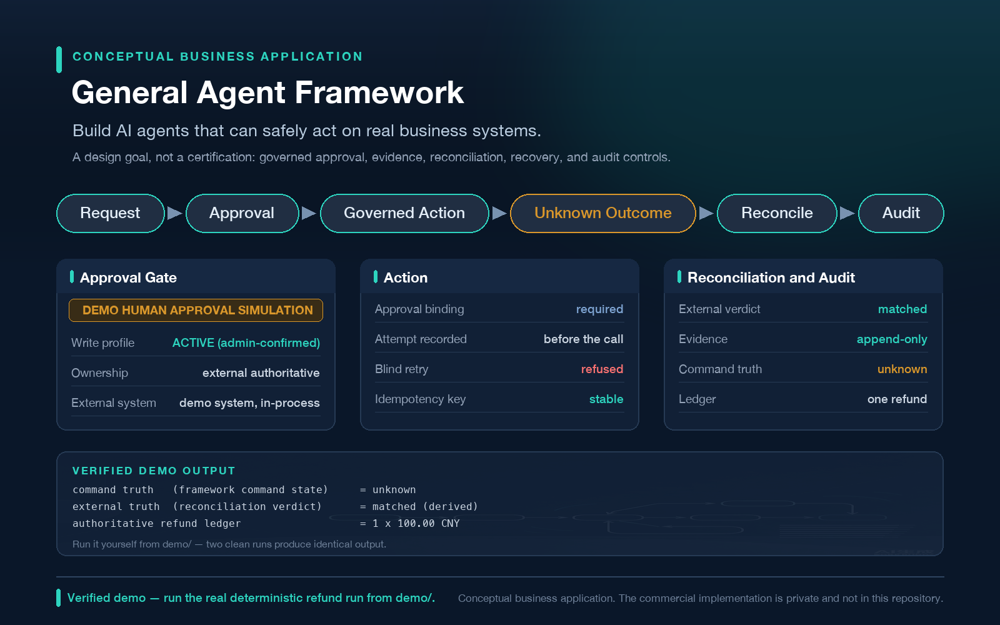

*Conceptual business application view — not an existing product. The "VERIFIED DEMO OUTPUT" band quotes the real deterministic run shipped in this repository.*

**Governed actions** · **Human approval** · **Durable execution** · **Safe external writes** · **Reconciliation & recovery** · **Auditability** · **Extensibility**

[See the real governed refund demo ↓](#real-verified-demo) · [Public vs commercial boundary](#public-vs-commercial-boundary)

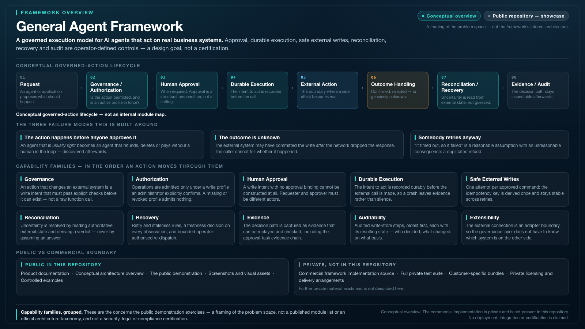

*Conceptual framework overview — a framing of the problem space, not an internal module map or a certification.*

---

## Why this exists

Many agent frameworks make it easy to decide what to do. Very few make it safe to *do*
something irreversible in a system you do not own.

Connecting a model to a tool is a day of work. Making the resulting action survive contact with
a real business system is not, because the failure modes are not the loud ones. They are these:

| Failure mode | What actually goes wrong |
|---|---|
| **The action happens before anyone approves it** | An agent that is *usually right* becomes an agent that refunds, deletes or pays without a human in the loop — and the mistake is discovered afterwards. |
| **The outcome is unknown** | The external system may have committed the write *after* the network dropped the response. The caller is left with no idea whether the side effect happened. Retrying can duplicate it. Not retrying can lose it. |
| **Somebody retries anyway** | "It timed out, so it failed" is a reasonable assumption with an unreasonable consequence: a duplicated refund, a double charge, a repeated notification. |

The General Agent Framework treats those as first-class problems rather than edge cases.

---

## Core capabilities

The framework is built around the concerns this demo illustrates. In the order an action moves
through them:

- **Governed actions** — an action that changes an external system is expressed as a write
  intent that must pass explicit checks before it can exist, not as a raw function call.
- **Human approval** — approval is a structural precondition, not a setting. A write intent
  with no approval binding cannot be constructed at all.
- **Durable execution** — the intent to act is recorded durably before the external call is
  made, so a crash leaves evidence rather than silence.
- **Safe external writes** — idempotency keys are derived once and stay stable across retries;
  an indeterminate outcome is never optimistically re-sent.
- **Reconciliation & recovery** — uncertainty is resolved by reading authoritative external
  state, not by guessing.
- **Auditability** — the decision path is captured as evidence that can be replayed and checked.
- **Extensibility** — the external connection is an adapter boundary, so the governance layer
  does not have to know what system is on the other side.

> These are the concerns the demo exercises — a framing of the problem space, not a published
> module list or an official architecture taxonomy.

---

## Real, verified demo

Everything below is captured from a **real, deterministic run** of a public demo that ships in
this repository at [`demo/`](demo/README.md). Synthetic data only, no network, no credentials.

### The failure mode this demo is built around

The external system may have committed the write even when the caller never received a response.

> **UNKNOWN ≠ FAILED.** Treating "I don't know" as "it failed" is exactly how one refund becomes two.

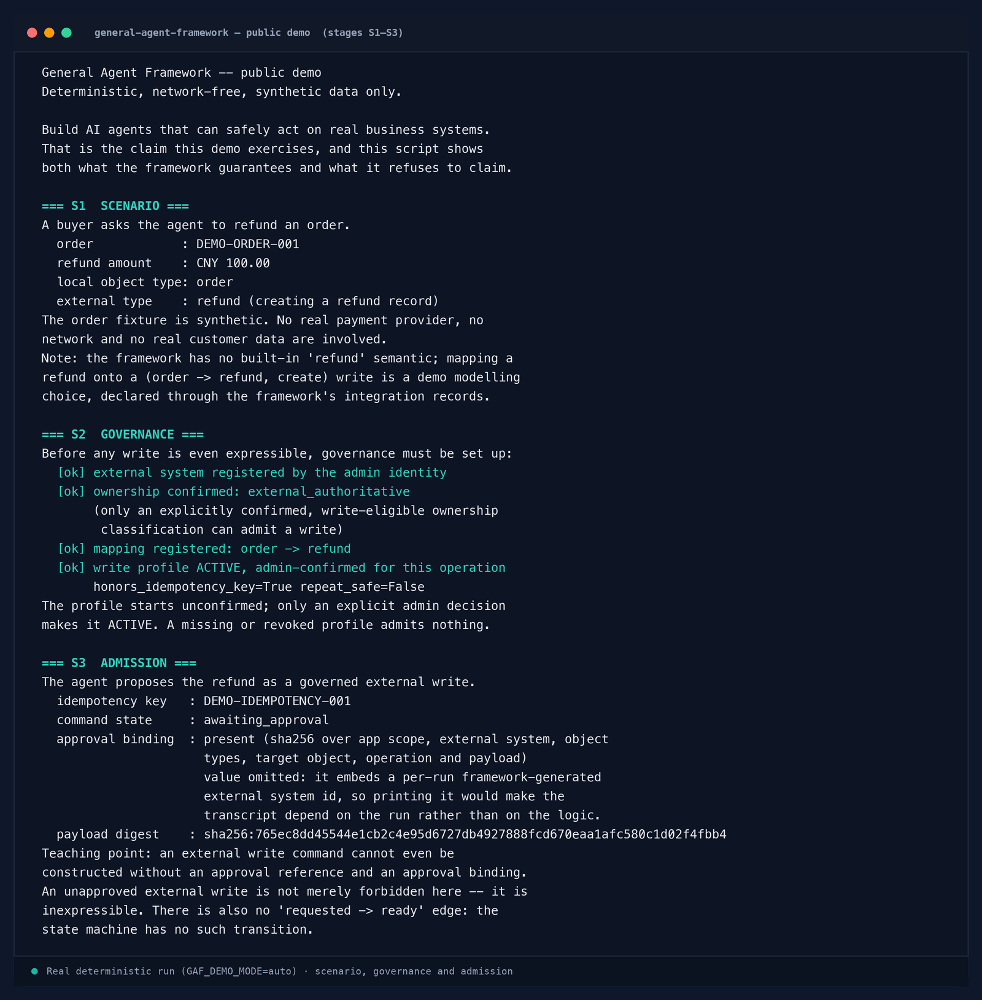

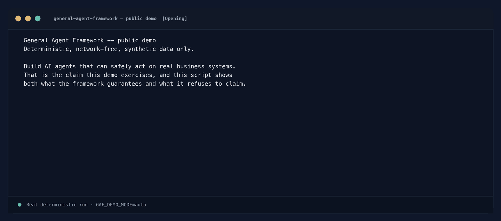

### What the demo demonstrates

| Step | What you will see |
|---|---|
| **Pre-approval action is blocked** | The framework refuses to dispatch before approval. Nothing reaches the external system. |
| **The approved write occurs exactly once** | One attempt, one recorded intent, one outbound call. |
| **The response becomes UNKNOWN** | The write was applied, but the response was lost. The framework records that it does not know — it does not guess. |
| **Blind retry is refused** | Re-sending is refused by the framework, so no second refund can be created. |
| **Reconciliation checks authoritative external state** | The agent reads the external system through the governed read path. |
| **External truth becomes MATCHED (derived)** | A fresh, usable reading agrees with what was intended; this verdict is not completion. |
| **Command truth honestly remains UNKNOWN** | The framework never rewrites "did not get confirmation" into "succeeded". |
| **Exactly one refund exists** | The authoritative ledger holds one CNY 100 refund — not two. |
| **The evidence and audit trail are retained** | The decision path is recorded, and the approval task's tamper-evident evidence chain verifies. |

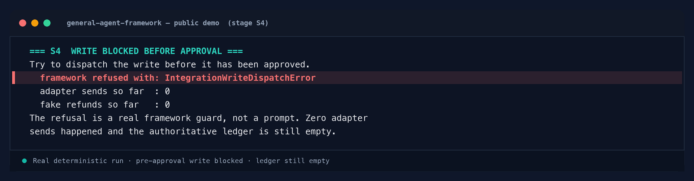

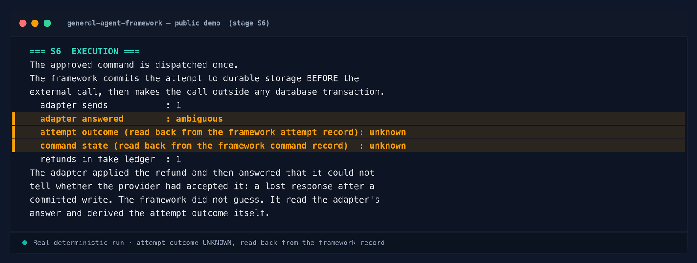

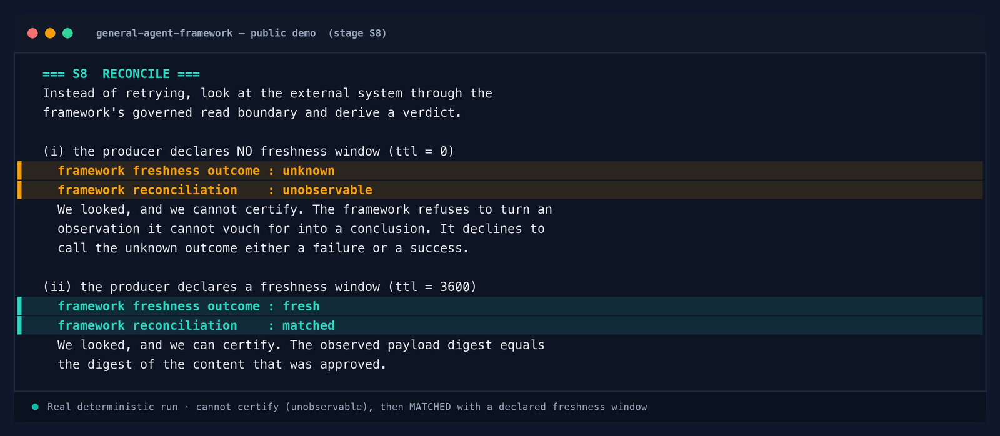

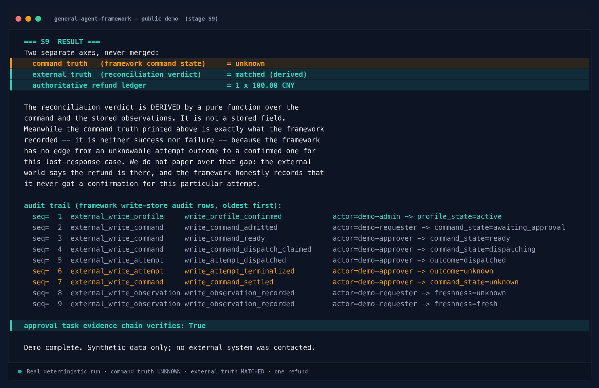

The demo ends on two axes, and they are deliberately never merged:

```text
command truth                                = unknown
external truth (reconciliation verdict)      = matched   (derived)
authoritative ledger                         = 1 x 100.00 CNY
```

The approval in this demo is a **DEMO HUMAN APPROVAL SIMULATION**. No real person approves a real
transaction, and no business system is contacted. The demo also substitutes only the transport:
every guarantee above the transport — authorization, approval binding, durable command and
attempt records, result classification, retry and staleness rules, the read boundary and its
freshness decision, and the reconciliation derivation — is the framework's own code path.

The framework has no built-in "refund" semantic; refunds here are modelled as a governed write of
a `refund` object derived from an `order`. That mapping is a demo modelling choice.

Read the full expected output in [`demo/EXPECTED_FLOW.md`](demo/EXPECTED_FLOW.md).

The [governed refund business visual](docs/use-cases.md#customer-support--governed-refund-example)
is grounded in this synthetic deterministic run; its application view is illustrative.

---

## Architecture overview

The framework overview near the introduction shows a **conceptual governed-write lifecycle** —
the concerns this demo illustrates, drawn end to end:

```text
Agent / Application
        ↓
Governance & Approval
        ↓
Durable Execution
        ↓
External Systems
        ↓
Reconciliation & Recovery
        ↓
Evidence / Audit
```

It is a framing of the problem space, not the framework's internal architecture and not a module
list. The **commercial implementation is private and is not present in this repository**; this
repository contains documentation, the public demo, and visual assets only.

Further reading: [Conceptual architecture](docs/architecture.md) ·
[Governed actions](docs/governed-actions.md) ·
[Reconciliation and recovery](docs/reconciliation-and-recovery.md) ·
[Use cases](docs/use-cases.md)

---

## Industry use cases

*Illustrative scenarios — not existing products, not exercised by this demo as business applications.*
Blueberry export and procurement are synthetic scenarios. The governed refund visual is grounded
in the [public deterministic refund demo](demo/README.md): synthetic data, simulated approval,
no live business system. Click a thumbnail to view its full-size visual.

<table>
  <tr>
    <td><a href="assets/visuals/scenario-blueberry-factory-export.png">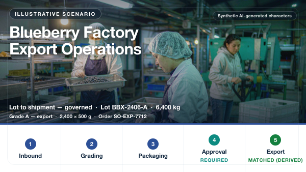</a></td>
    <td><a href="assets/visuals/scenario-governed-refund.png">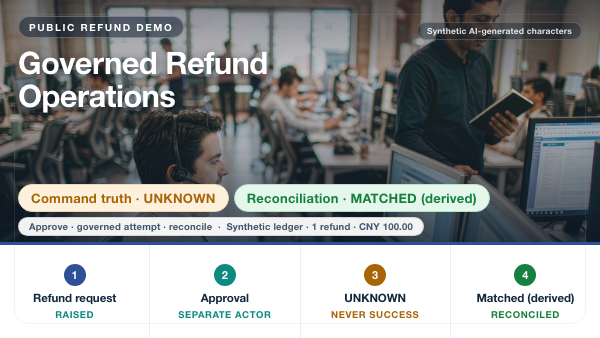</a></td>
    <td><a href="assets/visuals/scenario-procurement-change.png">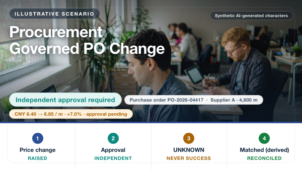</a></td>
  </tr>
</table>

COMMAND TRUTH remains UNKNOWN where the response is lost. MATCHED (derived) is an external-state
verdict, not completion or command success. See [use cases and scenario boundaries](docs/use-cases.md).

### Who this is for

This is the intended audience — not a list of existing customers, deployments, or case studies:

- AI agent and platform engineering teams
- SaaS teams adding governed AI actions
- enterprise IT and automation teams
- AI startups
- integration and consulting teams

---

## Public vs commercial boundary

This repository is the **public showcase**. The commercial framework is separate, private, and
privately licensed.

| Public in this repository | Private, not in this repository |
|---|---|
| Product documentation (`docs/`) | Commercial framework implementation source |
| Conceptual architecture overview | Full private test suite |
| The public demo (`demo/`) | Customer-specific bundles |
| Screenshots and visual assets | Private licensing and delivery arrangements |
| Controlled examples | |

Further private material exists and is not described here.

Access to the commercial framework is provided under a separate private licence. No fixed price
is published here. See [`COMMERCIAL.md`](COMMERCIAL.md).

---

## Security

Please **do not** report vulnerabilities through public GitHub issues.

Security reports go to: **pathetichomeless@outlook.com**

Use the subject prefix **[SECURITY]** followed by a short description — for example
`[SECURITY] <short description>`. Commercial enquiries use the same mailbox with the subject
prefix **[COMMERCIAL]**; the two are handled as separate categories. No response or remediation
SLA is promised. Full details in [`SECURITY.md`](SECURITY.md).

---

## Commercial access

This repository is **public to view and not open source**. Public availability grants no rights to
the commercial framework. See [`LICENSE`](LICENSE) and [`COMMERCIAL.md`](COMMERCIAL.md).

The commercial Framework is privately licensed and delivered.

For evaluation, licensing, source-access or commercial-use discussions:

- **Email:** pathetichomeless@outlook.com
- **WeChat:** pathetichomeless

Suggested email subject: **[COMMERCIAL] General Agent Framework**

For pricing and commercial access, please contact me by email or WeChat.
