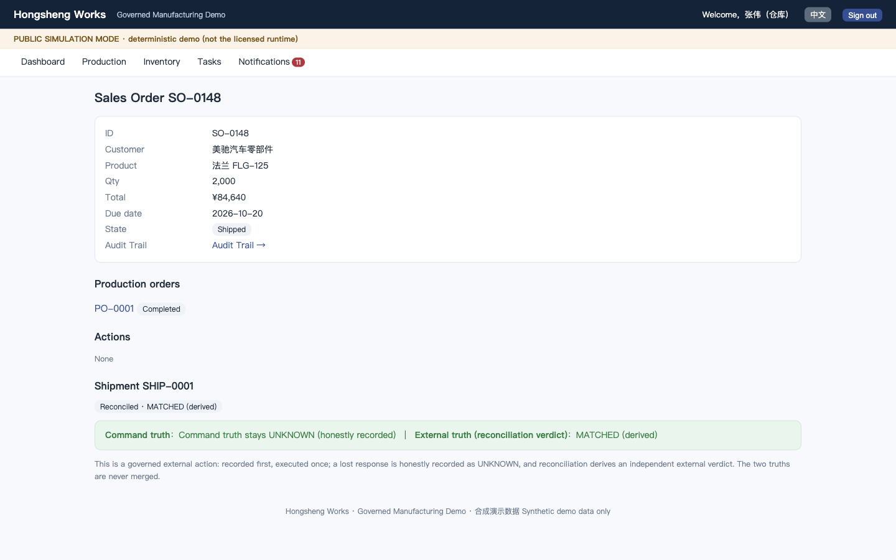

# 宏晟智造 Hongsheng Works — Governed Manufacturing Demo

**用一套可治理、可审计的方式，让 AI 参与真实工厂业务。**
**Build AI agents that can safely act on a real factory — under approval, evidence and audit.**

这是通用 Agent 框架的**主要公共业务演示**：一个可登录、多角色的小型精密五金厂业务系统（销售/报价/生产/库存/发货），演示 AI 建议、人工审批、通知、任务、交接与完整审计。

This is the **primary public business demo**: a small multi-role manufacturing application (quotation → order → production → shipment) showing governed AI assistance, human approval, notifications, tasks, handoff and a full audit trail.

## 运行 Run（公共模拟模式 Public Simulation Mode）

要求 Requirements: Python 3.10+（纯标准库 stdlib only，无依赖 no dependencies）

```sh
python3 demo/manufacturing/run_demo.py        # 默认 http://127.0.0.1:8765/
```

打开浏览器访问 `http://127.0.0.1:8765/`，使用演示账号一键登录（密码统一 `demo1234`）：

| 账号 | 角色 | 看点 |
|---|---|---|
| owner | 老板/总经理（林文昊） | 审批收件箱、经营摘要、审计验证 |
| factory | 厂长（王强） | 生产看板、逾期处置、排产 |
| sales | 销售（李婷） | AI 报价起草、订单、发货申请 |
| sales2 | 销售（Chen Xiao） | English UI、本人数据可见性 |
| warehouse | 仓库（张伟） | 领料/入库/发货执行 |
| admin | 系统管理员 | 用户与角色、审计（无业务操作权） |

运行测试 Tests: `python3 demo/manufacturing/tests/run_tests.py`

## 8 分钟演示故事 Demo story

销售用 AI 起草报价（8% 折扣自动送审批）→ 老板审批 → 订单确认 → AI 物料检查发现缺料 → 紧急采购审批 → 生产排产/领料/完工 → 仓库执行发货 → 承运商响应丢失，**命令真相诚实记录为 UNKNOWN** → 对账给出 **匹配（推导）** 的外部判定 → 老板/管理员在审计页回放全程并验证证据链。



*Command truth remains UNKNOWN; reconciliation reports MATCHED (derived) independently. Synthetic public simulation; no live carrier is contacted.*

完整分镜见 [EXPECTED_FLOW.md](EXPECTED_FLOW.md) 与 [docs/DEMO_SCRIPT.md](docs/DEMO_SCRIPT.md)。

## 两种模式 Two modes（绝不混淆 Never conflated）

- **公共模拟模式 Public Simulation Mode**（本仓库默认）：确定性模拟后端驱动完整业务流程，用于理解业务行为与治理边界。它**不是**商业框架运行时，也不证明商业框架的任何执行结果。
- **持牌框架模式 Licensed Framework Mode**（私有交付）：同一应用契约绑定到私有商业框架。该模式下的执行证明由框架自身承担——本仓库不包含该模式任何代码。

## 文档 Documentation

- [docs/ARCHITECTURE_CONTRACT.md](docs/ARCHITECTURE_CONTRACT.md) — Facade 架构与双后端契约
- [docs/BOUNDARY.md](docs/BOUNDARY.md) — 公共/私有边界与守卫
- [docs/DEMO_SCRIPT.md](docs/DEMO_SCRIPT.md) — 分镜脚本（8 分钟标准版）
- [docs/RBAC_MATRIX.md](docs/RBAC_MATRIX.md) — 角色权限矩阵
- [docs/DATA_MODEL.md](docs/DATA_MODEL.md) — 实体模型与状态机
- [docs/TERMINOLOGY.md](docs/TERMINOLOGY.md) — 中英双语术语表
- [PUBLIC_DEMO_MANIFEST.md](PUBLIC_DEMO_MANIFEST.md) — 边界常量清单

## What this demo is not

- 本演示是**设计目标展示，不是认证**：“安全”指在明示的治理/审批/证据/恢复控制之下运行，不构成任何安全、法律或合规认证，也不暗示任何响应 SLA。
- 公共模拟模式的审批是**演示用人工审批模拟**：没有真实的人批准任何真实交易；所有数据均为合成数据，不联系任何真实外部系统。
- 模拟模式不证明商业框架执行了任何动作；持牌框架模式的证明独立成立。两者共用应用契约，**不是同一实现**。
- 本目录不含任何框架实现源码，也不授予任何许可。见 [PUBLIC_DEMO_MANIFEST.md](PUBLIC_DEMO_MANIFEST.md)。
