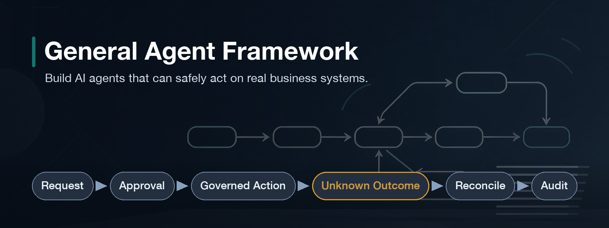

# Conceptual architecture

> **What this page is.** This is a *conceptual* description of the governed-write lifecycle — the
> concerns the public demonstration illustrates, drawn end to end. It is not the framework's
> internal architecture, not a module listing, and not a specification of private internals. The
> commercial implementation is private and is not present in this repository.

## The lifecycle

```text
Agent / Application
        ↓
Governance & Approval        <- is this action permitted, and has a human authorized it?
        ↓
Durable Execution            <- record the intent to act, before acting
        ↓
External Systems             <- the system that actually changes
        ↓
Reconciliation & Recovery    <- did it happen? resolve the uncertainty from external truth
        ↓
Evidence / Audit             <- what was decided, by whom, and on what basis
```



Each layer exists because the layer above it cannot solve that problem on its own:

- **Agent / Application** decides *what* should happen. It is not trusted to decide whether the
  action is permitted.
- **Governance & Approval** answers whether the action may proceed. It is deliberately separate
  from the code that proposes the action, so a helpful agent cannot approve itself.
- **Durable Execution** makes the intent to act survive a crash. The record is written before the
  external call, not after it.
- **External Systems** is the boundary where a side effect becomes real and, usually,
  irreversible.
- **Reconciliation & Recovery** exists because a write can succeed while its confirmation is
  lost. The answer is read from authoritative external state rather than assumed.
- **Evidence / Audit** makes the whole path inspectable after the fact.

## Where the commercial implementation sits

The commercial framework behind this repository is **private**. Its implementation is not included
here, and no part of this repository should be read as a description of it. This page describes the
*shape of the problem* that the public demonstration exercises.

The demonstration substitutes only the transport — the connection to the external system — so that
it can run deterministically and offline. Everything above that transport boundary is the
framework's own behaviour.
