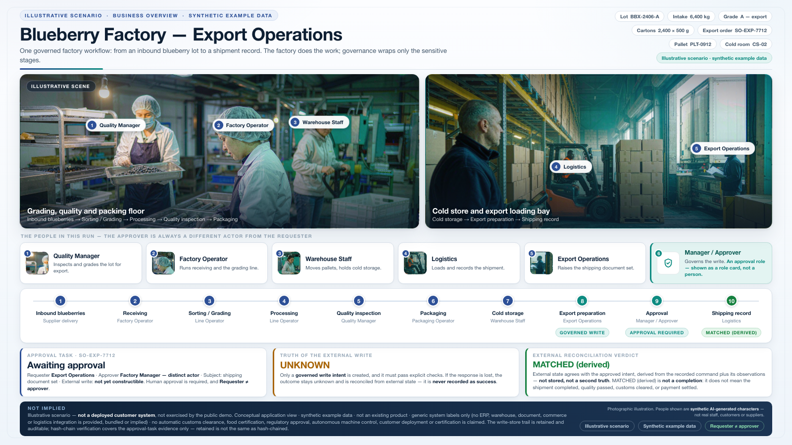
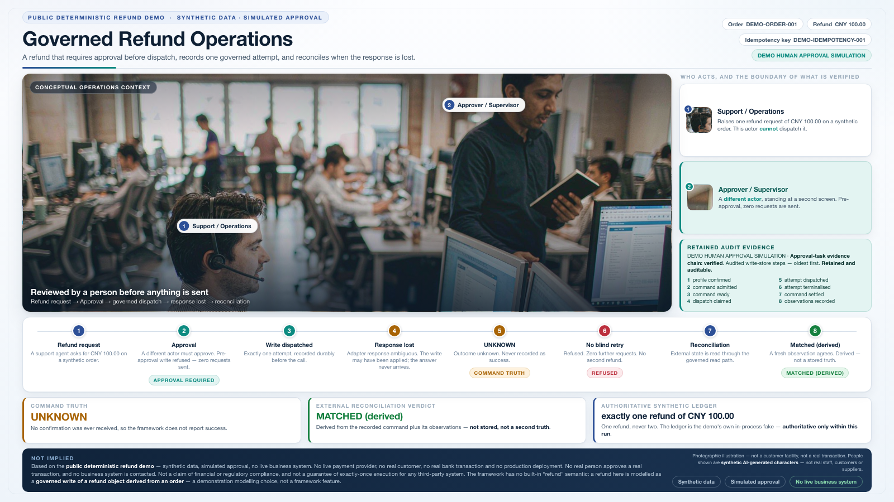
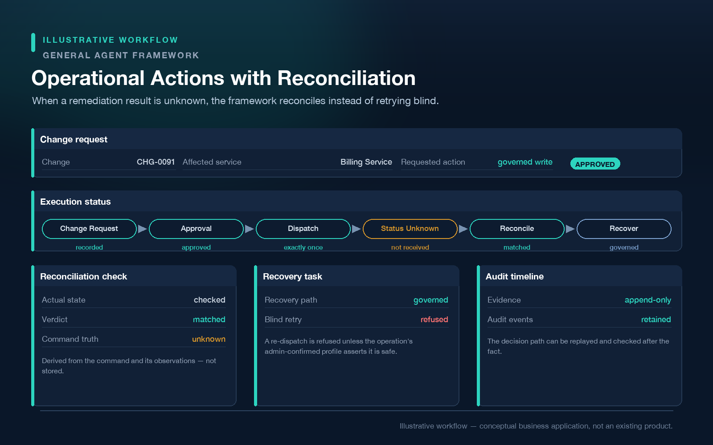
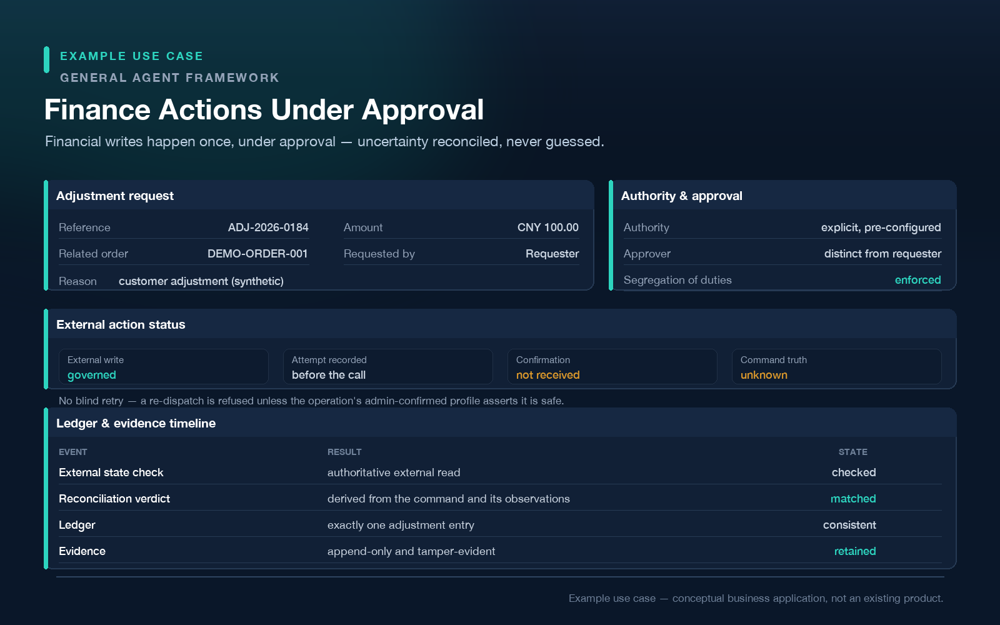
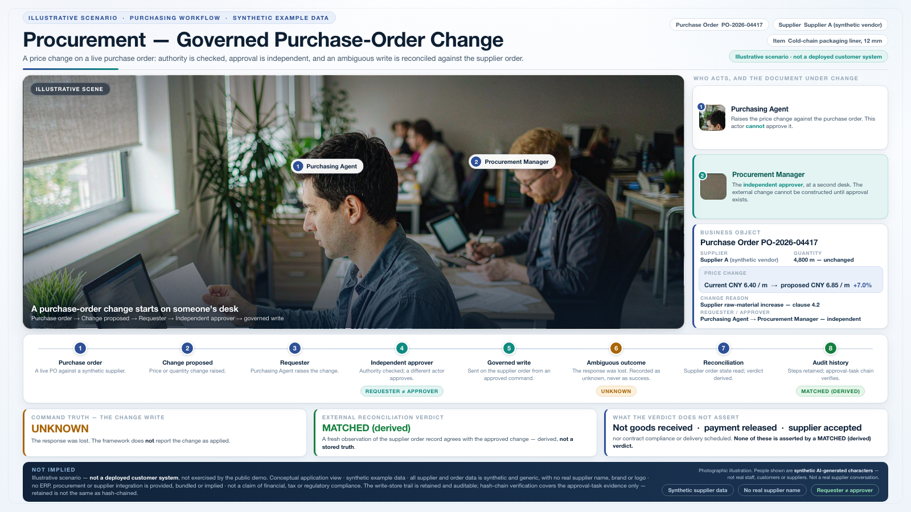

# Use cases

Every business application on this page is an **illustrative example**, not an existing product
or a shipped feature. Blueberry export, procurement and the other industry scenarios are synthetic
and are not exercised by the public demo. The governed refund visual is grounded in the
[public deterministic refund demo](../demo/README.md), under its explicit qualification:
synthetic data, simulated approval, no live business system. The business application view itself
is illustrative.

For the three business visuals below, COMMAND TRUTH remains UNKNOWN when the response is lost;
MATCHED (derived) is not completion and never changes UNKNOWN into SUCCESS. Hash-chain verification
covers approval-task evidence only; retained/auditable write-store records are not in that same
chain. These visuals make no customer deployment, certification, compliance, ROI, supported
integration or universal exactly-once claim.

---

## Blueberry Factory — export operations

*Illustrative scenario — not an existing product, not exercised by this demo. Synthetic example data.*

*MATCHED (derived) does not assert shipment completion, quality acceptance, customs clearance or
payment settlement.*

## Customer Support — governed refund example

*Illustrative business application — not an existing product. Grounded in the public deterministic
refund demo: synthetic data, DEMO HUMAN APPROVAL SIMULATION, no live business system.*

Refunds and sensitive account actions that must not be triggered by an agent alone. The refund
scenario shown in this repository's [public demo](../demo/README.md) is the closest analogue — and
note that the framework has no built-in notion of a "refund": the demo models one as a governed
write, which is itself the point.

*The synthetic ledger holds one refund of CNY 100.00 and is authoritative only within this demo
run. COMMAND TRUTH remains UNKNOWN; MATCHED (derived) does not confirm command success or
business completion. This is not a real transaction or an exactly-once guarantee for a third-party system.*

## IT Operations — example use case

*Illustrative scenario — not an existing product, not exercised by this demo.*

Remediation, recovery and change execution against production systems, where an automated action
that runs twice can be as damaging as one that never runs.

*Operational Actions with Reconciliation — a conceptual business application, not an existing
product, and not a claim of distributed or multi-node correctness.*

## Compliance — example use case

*Illustrative scenario — not an existing product, not exercised by this demo.*

Decision paths that must be reviewable afterwards: who proposed an action, who authorised it, what
the basis was, and what the external system ended up containing.

## Knowledge Operations — example use case

*Illustrative scenario — not an existing product, not exercised by this demo.*

Publishing a document version to a live knowledge base, where applying the same change twice is the
failure mode that matters.

## Finance Operations — example use case

*Illustrative scenario — not an existing product, not exercised by this demo.*

Controlled writes into financial and business systems, where an unconfirmed write is a materially
different situation from a failed one.

*Finance Actions Under Approval — a conceptual business application, not an existing product, and
not a claim of financial or regulatory compliance.*

## Procurement — example use case

*Illustrative scenario — not an existing product, not exercised by this demo.*

Supplier and purchasing actions that must pass an approval chain before they reach an external
system. The purchase order, supplier and values in this visual are synthetic.

*MATCHED (derived) does not assert goods received, payment released, supplier acceptance, contract
compliance or delivery scheduled.*

---

## A note on what these are not

These are problem shapes, not a product roadmap. No specific industry integration is provided,
bundled or implied by this repository, and no named third-party system is endorsed or supported by
virtue of appearing in a scenario description.
