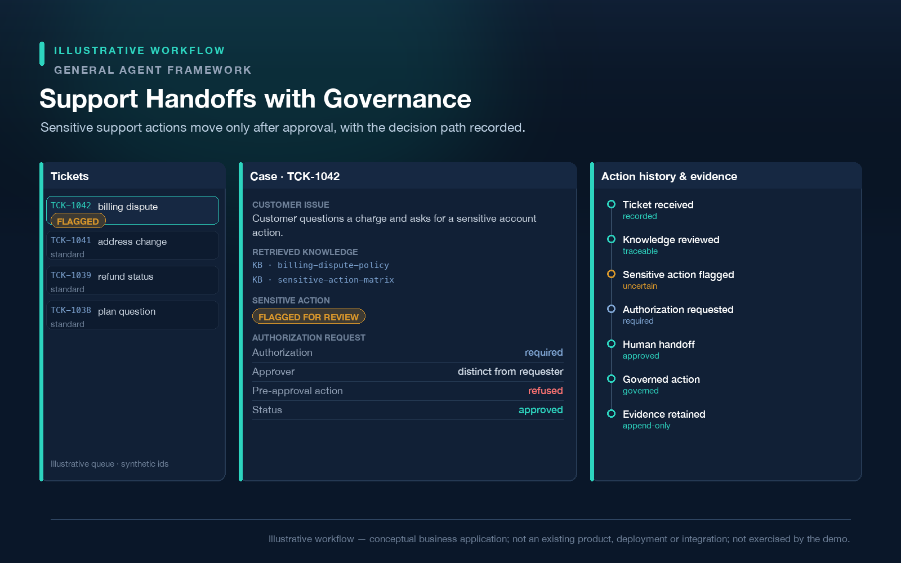

# Use cases

Every scenario on this page is an **illustrative example**. They show the shape of the problem the
framework addresses. They are **not existing products**, they are **not shipped features**, and
**none of them is exercised by the public demo** (the demo covers the refund scenario only).

---

## Customer Support — example use case

*Illustrative scenario — not an existing product, not exercised by this demo.*

Refunds and sensitive account actions that must not be triggered by an agent alone. The refund
scenario shown in this repository's [public demo](../demo/README.md) is the closest analogue — and
note that the framework has no built-in notion of a "refund": the demo models one as a governed
write, which is itself the point.

*Support Handoffs with Governance — a conceptual business application, not an existing product.*

## IT Operations — example use case

*Illustrative scenario — not an existing product, not exercised by this demo.*

Remediation, recovery and change execution against production systems, where an automated action
that runs twice can be as damaging as one that never runs.

*Operational Actions with Reconciliation — a conceptual business application, not an existing
product, and not a claim of distributed or multi-node correctness.*

## Compliance — example use case

*Illustrative scenario — not an existing product, not exercised by this demo.*

Decision paths that must be reviewable afterwards: who proposed an action, who authorised it, what
the basis was, and what the external system ended up containing.

## Knowledge Operations — example use case

*Illustrative scenario — not an existing product, not exercised by this demo.*

Publishing a document version to a live knowledge base, where applying the same change twice is the
failure mode that matters.

## Finance Operations — example use case

*Illustrative scenario — not an existing product, not exercised by this demo.*

Controlled writes into financial and business systems, where an unconfirmed write is a materially
different situation from a failed one.

*Finance Actions Under Approval — a conceptual business application, not an existing product, and
not a claim of financial or regulatory compliance.*

## Procurement — example use case

*Illustrative scenario — not an existing product, not exercised by this demo.*

Supplier and purchasing actions that must pass an approval chain before they reach an external
system.

---

## A note on what these are not

These are problem shapes, not a product roadmap. No specific industry integration is provided,
bundled or implied by this repository, and no named third-party system is endorsed or supported by
virtue of appearing in a scenario description.
